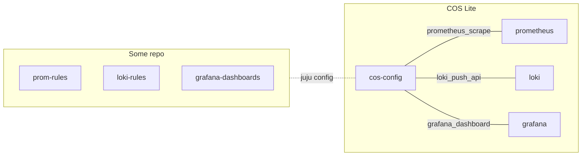

## Deployment scenarios

You need to deploy a `cos-config` app per repo.

```mermaid
flowchart LR
  subgraph repo [Some repo]
    prom-rules
    loki-rules
    grafana-dashboards
  end

  repo -.-|juju config| cos-config

  subgraph COS Lite
    cos-config ---|prometheus_scrape| prometheus
    cos-config ---|loki_push_api| loki
    cos-config ---|grafana_dashboard| grafana
  end

  click prometheus https://github.com/canonical/prometheus-k8s-operator/
  click loki https://github.com/canonical/loki-k8s-operator/
  click grafana https://github.com/canonical/grafana-k8s-operator/
  click prometheus-scrape-config https://github.com/canonical/prometheus-scrape-config-k8s-operator/
```
